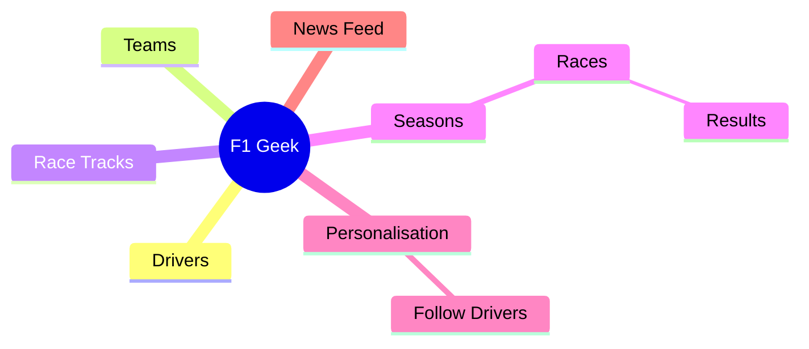

# F1 Geek

You have been commissioned by Formula 1 to create an app that will display information about teams, drivers, circuits and races.  The app will be called F1 Geek.

## Step 1: What is Formula 1?

Formula 1 is the highest class of international auto racing for single-seater formula racing cars sanctioned by the Fédération Internationale de l'Automobile (FIA). The World Drivers' Championship, which became the FIA Formula One World Championship, has been one of the premier forms of motor racing around the world since its inaugural season in 1950. The word "formula" in the name refers to the set of rules to which all participants' cars must conform.

You will notice that some people on your development team are Formula 1 fans and experts.  You will also notice that there will be members of your team that are not fans and have never watched it and may not care about it.

Within a product development team, you will have a mix of people with different skills and knowledge.  This is a good thing as it will help you to create a better product. For example, you can sounds ideas off each other and get different perspectives.

Having someone that is completely new to a topic is sometimes rare and can be very beneficial.  They can ask questions that others may not think of and can help to ensure that the product is accessible to a wider audience.

Having experts on the team is also beneficial as they can provide insights and knowledge that others may not have.  They can also help to ensure that the product is accurate and authentic.  However, it is important that these "experts" do not dominate the team and that everyone has a voice.  They must remain open to new ideas and be willing to listen to others.

To ground everyone in Formula 1, it is suggested you read:

* [What is Formula 1](https://www.formula1.com/en/latest/article/drivers-teams-cars-circuits-and-more-everything-you-need-to-know-about.7iQfL3Rivf1comzdqV5jwc)

Formula 1 is divided into 10 teams, each with two drivers.

* [Drivers](https://www.formula1.com/en/drivers)
* [Teams](https://www.formula1.com/en/teams)

These compete for both the Drivers' and Constructors' Championships.

* [Constructors Championship](https://www.formula1.com/en/latest/article/the-beginners-guide-to-the-f1-constructors-championship.66nTfWSqrUYv3bnbosPkHV)
* [Drivers Championship](https://www.formula1.com/en/latest/article/the-beginners-guide-to-the-f1-drivers-championship.53MjXJzTDxQnfxfoCLnxNZ)

## Step 2: Discovery and Brainstorming

First, we will brainstorm (as we did on 2024/10/14) with a focus on getting terms and concepts on the board.  Our senior design engineer begins mind mapping with the team.  After a a few rounds of questions and ideation, we have the following mind map:

### Mind Map

For more information on a mind map, see [Mind Map](https://en.wikipedia.org/wiki/Mind_map).  Of course take wikipedia with a grain of salt and use it as a starting point, ensure any information you use is accurate and up to date and cited.

### Step 3: User Stories

The anatomy of a user story is:

* As a \<type of user\>, I want \<some goal\> so that \<some reason\>.

For more information, see: [https://www.atlassian.com/agile/project-management/user-stories](https://www.atlassian.com/agile/project-management/user-stories).

To create user stories we first need to identify the types of users that will use our app.  We can start with the following:

* Formula 1 fan
* Formula 1 expert
* New fan

Initially, we want to focus on the first type of user:

* As a Formula 1 fan, I want to see a list of drivers so that I can see who is competing in the championship.
* As a Formula 1 fan, I want to see a list of teams so that I can see who is competing in the championship.
* As a Formula 1 fan, I want to drill down into a driver so that I can see more information about them.
* As a Formula 1 fan, I want to drill down into a team so that I can see more information about them, including their drivers.

### Step 4: The bad news

Unfortunately, the Formula 1 season is starting soon and we need to get a minimum viable product (MVP) out the door.  This means we need to focus on the most important features and get them working as soon as possible.  We can then iterate on the product and add more features later.
