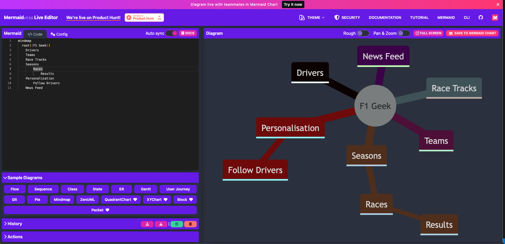
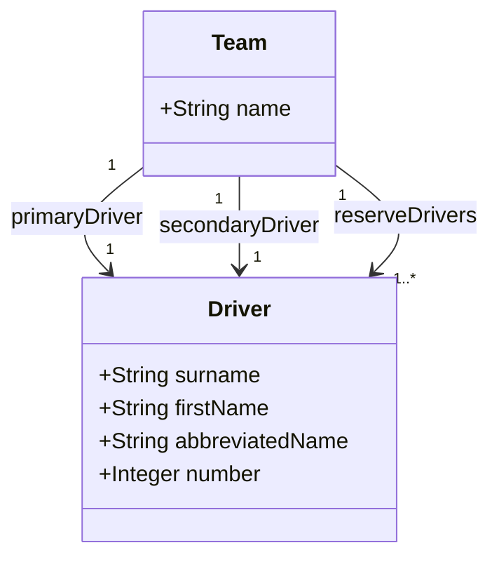
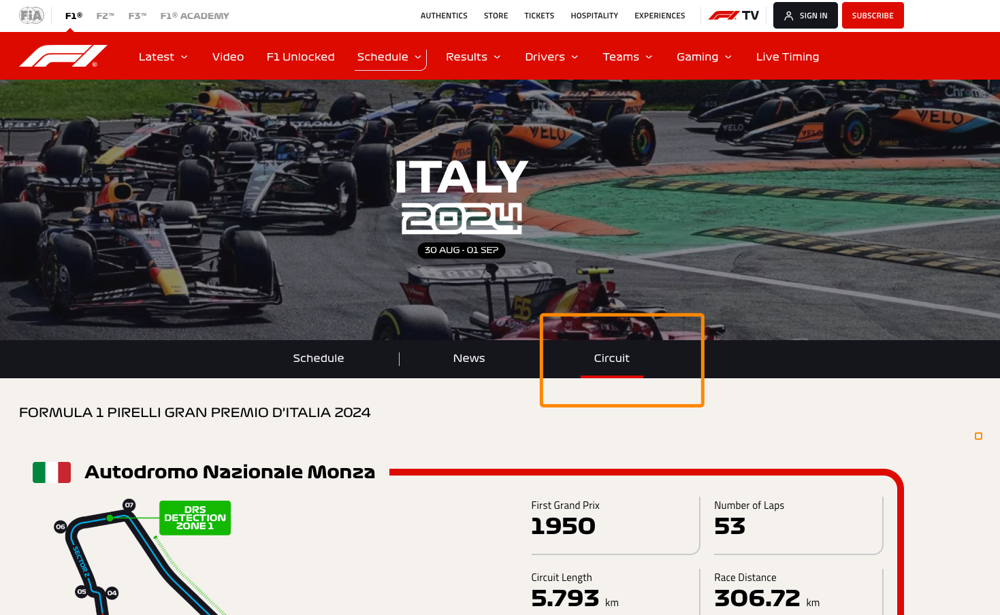

# Assignment Details

Your assignment is to build on the F1 Geek App from the labs.  You need to ensure you have completed everything up to and including [Week 5 Lab 1](https://tutors.dev/lab/setu-mad1/topic-5-Testing-and-State/unit-1/book-01-state).

## Mind Map

Improve on the ideation of the F1 Geek app.  Take the Mind Map from the introduction and expand on it, you must use mermaid to create a mind map.  You can use the previous mind map as a starting point:

This is alive link that may work: [Live Mind Map](https://mermaid.live/edit#pako:eNpVkLGOAjEMRH8lcgUSzbVbo6XidDoo01ibAaJNYuQkoBPi3y_AAnfdzPPItuZCgzhQR9EnF_lokzEqUmaz_sOsgHE-vyFjlupP0PwwW3Cc5DcPMFvlYZzABpwlTeaZ-GPvCLmGMsGvtlYSB5-5eEnvZC8hyPn_5U-cs-kBRwuK0Mjetecvt6GlckCEpa5JxzpasunaclyLbH7SQF3RigXVo-OCpee9cqRuxyE3qlL3h5eD80V0_ejmXtH1F9HaXos)

If that doesn't render correctly, the source code for the mind map is on the previous page, just paste it into the mermaid live editor.

Hints:

* Maybe Add more to the personalisation section
* What kind of stories could a news feed have?

Remember we walked through a mind map in class, if you were absent, please consult your peers for the notes.  If you are still unsure, consult the information about Formula 1 in the previous section and see what entities you can pull out of that. Also, think about features another app has, even if they are not F1 specific, add them to the mindmap and add some branches.

## User Stories

Add 5 more user stories to the list from the previous section.  You can use the same format as the previous section.  You can use the same types of users as the previous section, or you can add more types of users.  You can also add more user stories for the same type of user.

## Design

Use Figma to design a list of teams using the Material Design components.

Remember, we used Figma in our [First Lab](https://tutors.dev/lab/setu-mad1/topic-01-mobile-apps-intro/unit-01/book-00-create-an-app/05)

You can find material design components in the Figma plugin.  You can also use the Material Design website to find the components you need.

You might consider that each team has a brand colour, you can use this to make the design more interesting.

Keep this simple.  You only need to design the list of teams, you don't need to design the whole app.  This also won't be the design you use in the sections below as we may not have covered enough material to implement it, just give yourself an idea of what it is like to design a screen.

## Data Modelling

Take the data model from our first F1 Geek Lab

Add the following to this diagram:

### Circuit

* Circuit (or race track)
  * name - string e.g. monza, monaco
  * country - string
  * length - number in kilometers

A list of circuits can be found [here](https://www.formula1.com/en/racing/2024), feel free to add 10 to your data model.

From the link above you can drill down into a track [https://www.formula1.com/en/racing/2024/italy](https://www.formula1.com/en/racing/2024/italy).  You can get information about the circuit from that page, [https://www.formula1.com/en/racing/2024/italy/circuit](https://www.formula1.com/en/racing/2024/italy/circuit)

### Results

A circuit has a list of results.  A result has the following:

* Result
  * first
  * second
  * third
  * year

These results can be fictional, but you can use the results from the 2023 or 2024 season as a starting point.

[https://www.formula1.com/en/results/2024/races](https://www.formula1.com/en/results/2024/races)

There should be a relationship between circuit and results, this should be represented in your class diagram.

There should also be tests for your data model, you can use the tests from the [previous lab](https://tutors.dev/lab/setu-mad1/topic-4-kotlin/book-01-kotlin/04) as a starting point.

## User Interface

Add a new screen to the F1 Geek app that displays a list of teams, you should be able to filter as with drivers.

Clicking on the team should show you the drivers for that team.

Clicking on the driver should show you more information about the driver.

[https://www.formula1.com/en/drivers](https://www.formula1.com/en/drivers)

Note: we will discuss a naive implementation of multi screens in the next lab, this naive approach is fine for now.

Note that all data should be hardcoded as it was done in the DriverStore in [https://tutors.dev/lab/setu-mad1/topic-5-Testing-and-State/unit-1/book-01-state/05](https://tutors.dev/lab/setu-mad1/topic-5-Testing-and-State/unit-1/book-01-state/05). You may want to implement a TeamStore.