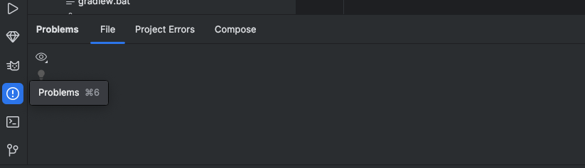

# Tips

When grading the android work, I will be looking for usages of:

* Functionality that actually works
* Correct usage of modifiers
* Extracted String Resources (e.g. for button or textbox labels)
* Images
* Row, Column, Box layouts
* Clean and concise kotlin
* Composable functions in separate files
* Usages of immutable kotlin collections
* Usages of data classes
* Tests that are clear and concise and test the correct thing
* No warnings or errors in your IDE

